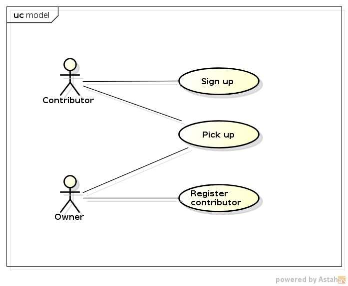

# Use Cases

## Actors
 * Owner: a person who registers the amount of coins found.
 * Contributor: a owner's friend who helps him/her.

## Use Cases List
 * [Pick up](uc_pickup.md)
 * [Add contributor](uc_add_contributor.md)
 * [Sign up](uc_signup.md)
